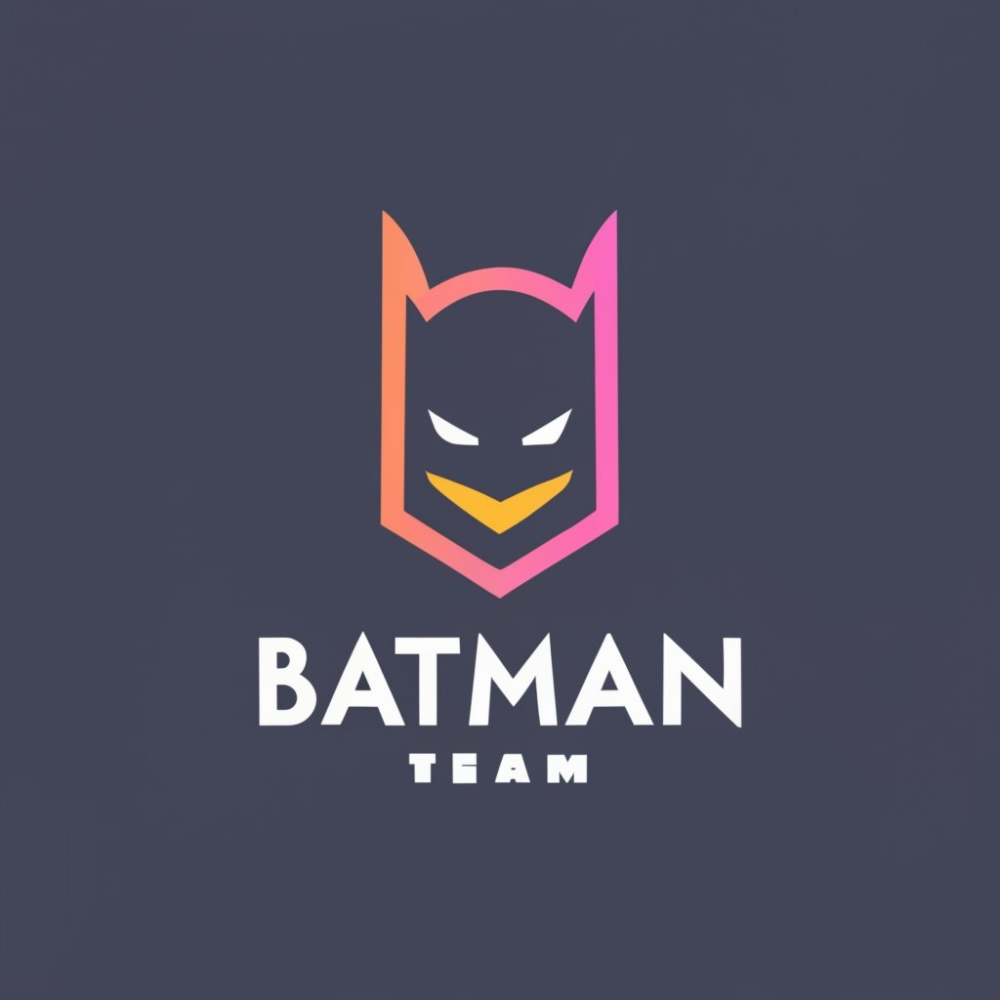
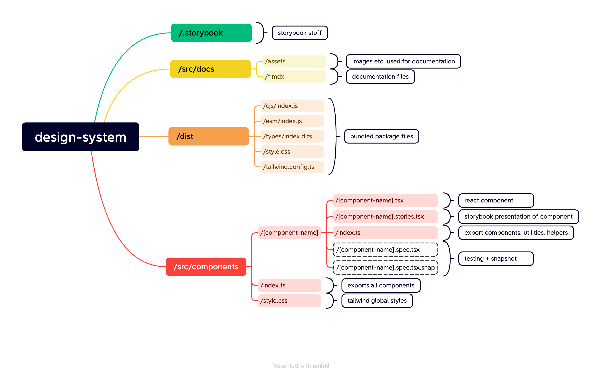

<!-- PROJECT SHIELDS -->

  

[Storybook](https://ost-cas-fee-adv-23-24.github.io/design-system-component-library-team-batman)

# Project: Design System Component Library

This project is a design system component library built with React, TypeScript & Tailwind.

It is a project for the CAS Frontend Engineering Advanced course at the OST. The goal of this project is to create a design system component library that can be used in other projects.

## Overview

## Getting Started

### Prerequisites

TODO: List any software or tools that need to be installed before running this project.

### Installation

TODO: Step-by-step instructions on how to install this project.

### Usage

TODO: Instructions on how to use this project.

## Running the tests

TODO: Explain how to run the automated tests for this system.

## Built With

TODO:

- List any frameworks, libraries, or other technologies used in this project.

## License

This project is licensed under the MIT - see the [LICENSE](LICENSE) file for details.

## Acknowledgments

TODO:

- Any credits or acknowledgments you want to give.
