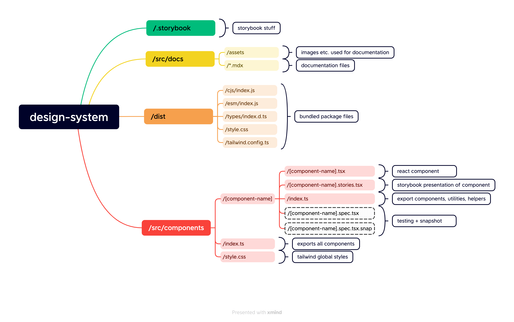

<!-- PROJECT SHIELDS -->

<div align="center">
  <a href="https://ost-cas-fee-adv-23-24.github.io/design-system-component-library-team-batman">
    
  </a>

<br/>

<a href="https://ost-cas-fee-adv-23-24.github.io/design-system-component-library-team-batman" target="_blank"></a>

[](https://www.npmjs.com/package/@ost-cas-fee-adv-23-24/design-system-component-library-team-batman)


<br/>

</div>

# Project: Design System Component Library

This project is a design system component library built with React, TypeScript & Tailwind.  
It is a project for the CAS Frontend Engineering Advanced course at the OST. The goal of this project is to create a design system component library that can be used in other projects.

## Folder Structure

<div align="center">

</div>

## 💻 Stack

- ⚛️ [react](https://reactjs.org/): JavaScript library for building user interfaces.
- ⏩ [next](https://nextjs.org/): React framework for server-side rendering, static site generation, and more.
- 🎨 [tailwindcss](https://tailwindcss.com/): Utility-first CSS framework for rapidly building custom designs.
- 📘 [typescript](https://www.typescriptlang.org/): Typed superset of JavaScript that compiles to plain JavaScript.
- 📚 [storybook](https://storybook.js.org/): UI development environment and component library for building, documenting, and testing UI components.
- ⚙️ [@headlessui/react](https://headlessui.dev/react/): Completely unstyled, fully accessible UI components, designed to integrate beautifully with Tailwind CSS.
- 🔧 [tailwind-merge](https://www.npmjs.com/package/tailwind-merge): Tailwind CSS plugin for merging utilities.
- 🔗 [clsx](https://www.npmjs.com/package/clsx): Tiny utility for constructing className strings conditionally.
- 🚀 [framer-motion](https://www.framer.com/motion/): Production-ready animation library for React.
- 👮 [eslint](https://eslint.org/): Pluggable and configurable linter tool for identifying and reporting on patterns in JavaScript.
- ✏️ [prettier](https://prettier.io/): Opinionated code formatter that enforces a consistent code style.

## 📝 Project Summary

- [**src**](src): Main source directory containing all the project's components and utilities.
- [**src/docs**](src/docs): Directory for Storybook's documentation files.
- [**src/utils**](src/utils): Directory for utility functions.
- [**src/components**](src/components): Directory for reusable UI components.

## 🚀 Run Locally

1. Clone the design-system-component-library-team-batman repository:

```sh
git clone https://github.com/ost-cas-fee-adv-23-24/design-system-component-library-team-batman
```

2. Install the dependencies with one of the package managers listed below:

```bash
npm install
```

3. Start the development mode:

```bash
npm run storybook
```

4. Open [http://localhost:6006](http://localhost:6006) with your browser to see the result.

### 💡 Tipp

Don't forget to install the recommended extensions for vscode [**.vscode/extensions.json**](.vscode/extensions.json)

## 🚀 Build package

```bash
npm run build
```

Output will be in the `dist` folder.

## 🚀 Install package

install package from npm

```bash
npm i @ost-cas-fee-adv-23-24/design-system-component-library-team-batman
```

## 🚀 Usage

To use the components styles, you have 3 Options:

- Option 1: import the minified css file in your project.

```js
import '@ost-cas-fee-adv-23-24/design-system-component-library-team-batman/style.css';
```

- Option 2: use the tailwind config as preset in your tailwind.config file.  
  [https://tailwindcss.com/docs/presets](https://tailwindcss.com/docs/presets)

```js
module.exports = {
  presets: [require('@ost-cas-fee-adv-23-24/design-system-component-library-team-batman/tailwind.config.ts')],

  // ... rest of your config
};
```

- Option 3: add module folder as content path to your tailwind.config file.  
  [https://tailwindcss.com/docs/content-configuration](https://tailwindcss.com/docs/content-configuration)

```js
module.exports = {
  content: [
    // ...
    './node_modules/@ost-cas-fee-adv-23-24/design-system-component-library-team-batman/dist/**/*.{js,ts,jsx,tsx}',
  ],
  // ... rest of your config
};
```

🎉 **after that you can use the components in your project.** 🎉

```js
import { Button } from '@ost-cas-fee-adv-23-24/design-system-component-library-team-batman';

const App = () => {
  return <Button>Click me</Button>;
};
```

### 💡 Next.js Server Components

Next.js 13 introduces a new `app/` directory structure. By default it uses Server Components. As some of our components use React hooks, we added in those cases the `"use client";` tag, so you can import them directly in your React Server Components (RSC).

## 🙌 Maintainers (Team Batman)

<table style="border:1px solid #404040;text-align:center;width:100%">
<tr><td style="width:14.29%;border:1px solid #404040;">
        <a href="https://github.com/onivue" spellcheck="false">
          
          <br />
          <b>onivue</b>
        </a>
        <br />
        <a href="https://github.com/ost-cas-fee-adv-23-24/design-system-component-library-team-batman/commits?author=onivue" title="Contributions" spellcheck="false">
          contributions
        </a>
      </td><td style="width:14.29%;border:1px solid #404040;">
        <a href="https://github.com/risuiar2023" spellcheck="false">
          
          <br />
          <b>risuiar2023</b>
        </a>
        <br />
        <a href="https://github.com/ost-cas-fee-adv-23-24/design-system-component-library-team-batman/commits?author=risuiar2023" title="Contributions" spellcheck="false">
         contributions
        </a>
      </table>

## 📄 License

This project is licensed under the **MIT License** - see the [**MIT License**](https://github.com/ost-cas-fee-adv-23-24/design-system-component-library-team-batman/blob/main/LICENSE) file for details.
